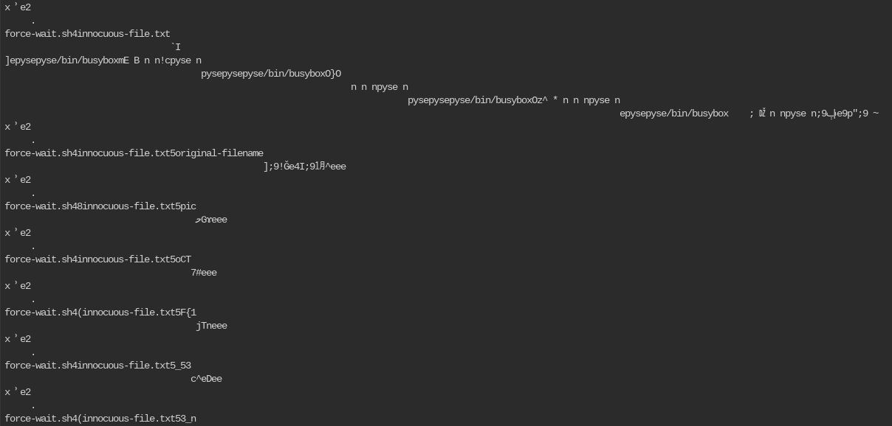

# Dear Diary

## Metadata

[Challenge](https://play.picoctf.org/practice/challenge/413?category=4&originalEvent=73)

## Solution

I first got the file and unzipped it in the `/tmp` directory.

I used `mmls` on the file to look at the disks. The [Pico Primer](https://primer.picoctf.com/#_disk_analysis) was really helpful to learn how to use sleuthkit. Since the 4th partition was the biggest and a linux disk, I decided to look at it first.

I initially tried to search it directly with `fls`. I looked at `/home`, but there was nothing in it. I did get to `/root`, which contained an ash history file with a `secret-secrets` folder.

`.ash_history` didn’t contain much, and the `secret-secrets` folder had a script with two blank files.

I then tried to search for text files and the picoCTF and flag strings.

There was nothing for picoCTF, while flag gave a bunch of garbage. I tried to manually search the drive even more until I gave up. When I returned to this problem, I realized that the repeated `innocuous-file.txt` mentions were interesting because it could be what the `secret-secrets` folder meant? I tried to get the location of those strings.

Now I needed to get the inode of those strings. I used 728730680 instead of 600033336 because there are a lot of numbers near 728730680 which most likely means that they are in the same file. After I did a search for previous picoCTF problems involving disks, I found that there was a `ifind` command that could find the inode number from the block number. However, the strings command prints their distance from the start, so I needed to do some math.

I first needed to get the offset from the partition. Since the partition start is recorded in sectors, while the strings command prints as bytes, I needed to convert the sectors to bytes, then subtract it. The block size is 512 from the earlier mmls command. The partition start is 584056832, which makes the new offset 144673848 in bytes.

This needs to be converted into blocks. To get the block size, I used the `fsstat` command, which shows that the block size is 1024.

This means that 1024 bytes is one block, so I could just divide to get the answer. However, doing the division doesn’t give an integer. This is because the string might not be at the very beginning at the file. Since the file probably isn’t very big, how about I round down the number? This gives 141283 as the block number.

Now the ifind command can be used.

The inode number is 8! When I tried to read the file directly with icat, it gave a bunch of garbage back, but the `innocuous-file.txt` mentions can still be seen. Let’s grep the file (and don’t forget to use `-a`!):

We can see the picoCTF tag in it: it’s spread out over a bunch of lines. Looking at the picture closer, it seems that the last three characters after `innocuous-file.txt` have the characters in the flag. Repeating this for every line until the end brace gives me the code: `picoCTF{1_533_n4m35_80d24b350}`
