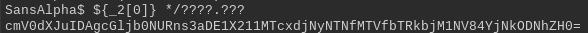

# Sans Alpha

## Metadata

[Challenge](https://play.picoctf.org/practice/challenge/436?category=5&originalEvent=73)

## Solution

Let’s log in into the running instance.

I tried a bunch of random inputs to see what it would do for invalid inputs.

So it seems that entering invalid characters would give an "Unknown character detected" message. I did find a way on how to launch bash without any letters, but it didn’t really seem to do anything here.

After that, I did a search to see if there were any special characters that could be used to get letters (like the hint for the problem says). I found a [bash scripting guide](https://tldp.org/LDP/abs/html/special-chars.html) and there was something very interesting there:

Let’s see if they are disabled on the instance:

They’re not! That means that we could use them to generate characters for filenames! Since most command line utilities are in the `/bin` folder, we could use wildcards to get them. Since we already know that forward slashes (`/`) are not disabled, we can go across directories too. Let’s try to get the `cat` command so we can print out stuff:

I used the first three question marks for bin, and the last three question marks for cat. Unfortunately, there seems to be another binary before it in alphabetical order.

I originally thought that the wildcards would pick the first option that matched, so I tried to use base64 instead. Since it has numbers which most binaries don’t have, we’ll be more likely to get our desired binary. Let’s try that:

When I got this output, I got really confused. After a bit of research, it turns out that the wildcard operators don’t just pick the first option they see; they expand into each of their possible options.

Example: if I ran a command `echo *.jpg` with three files `a.jpg`, `b.jpg`, and `c.jpg` in the current directory, the command would really be `echo a.jpg b.jpg c.jpg`. For our situation, the command would turn into `/bin/base64` followed by whatever other files there are that match this pattern. We know that `/bin/base64` goes first because it generates a base64-looking output. But how do we just get `/bin/base64` and not the other commands?

It turns out that bash arrays love the format that the wildcards give as output. Bash arrays can be declared as an open paren followed by the elements separated by spaces, and then followed by close parens. This is good, because that means we can store the wildcard elements as a list, and then access our binary through the first element of the list.

We can store the array in a variable to access later, and then access the base64 binary through array indexing. Let’s try it:

Yay, it works! Now we just need to figure out where the flag is stored. I assumed that the flag would be named `flag.txt`, so I tried `????.???`, which gave an error about a file not existing. I tried `*/????.???`, since it could be in any directory. It works:

Now we can use base64 on the file to get the flag!

Using a base64 decoder, it gave me `return 0 picoCTF{7h15_mu171v3r53_15_m4dn355_8b3d83ad}`. While the `return 0` is kind of strange, we don’t need to worry about it. The flag is `picoCTF{7h15_mu171v3r53_15_m4dn355_8b3d83ad}`.
